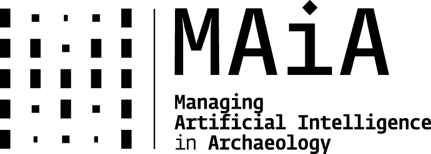
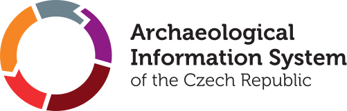
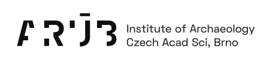

## Instructors & organizers

**Petr Pajdla** [ 0000-0001-7050-9572](https://orcid.org/0000-0001-7050-9572)  
*Czech Academy of Sciences, Institute of Archaeology, Brno*  

<!-- ::: {.justify}
Petr is one of AIS CR infrastructure coordinators with expertise in Linked Open Data, archival data processing, and Open Science.
Petr is the course convenor for this Training School and the main contact for your questions. 
::: -->

**Ronald Harasim**  
*Czech Academy of Sciences, Institute of Archaeology, Brno*  

<!-- ::: {.justify}
Ronald is a full-stack developer and ML-engineer.
::: -->

**Anastasia Eleftheriadou** [ 0000-0002-8649-3752](https://orcid.org/0000-0002-8649-3752)  
*Ludwig-Maximilians-Universität München*

**Filip Hájek** [ 0009-0007-5953-8840](https://orcid.org/0009-0007-5953-8840)  
*Czech Academy of Sciences, Institute of Archaeology, Brno*  

<!-- ::: {.justify}
Filip is a data specialist with background in maritime and digital geoarchaeology applying GIS, 3D modeling, remote sensing, and coding to study prehistoric human-sea interactions and environmental change.
::: -->

### Support

**Zuzana Kopáčová**  
*Czech Academy of Sciences, Institute of Archaeology, Brno*  
Finances, administration

**David Spáčil**  
*Czech Academy of Sciences, Institute of Archaeology, Brno*  

And the **AIS CR** team members...

### Any questions?

Please direct any of your possible questions or inquiries to **Zuzana Kopáčová** ([kopacova [at] arub.cz](mailto:kopacova@arub.cz)), and/or **Petr Pajdla** ([pajdla [at] arub.cz](mailto:pajdla@arub.cz)).

## Organisations

### ATRIUM

:::{.justify}
The training school is organised as transnational access provision in the [ATRIUM Project](https://atrium-research.eu/){.external} (*Advancing Frontier Research in the Arts and Humanities*) funded by the Horizon Europe research and innovation actions programme under grant agreement No. [101132163](https://cordis.europa.eu/project/id/101132163){.external}.
*ATRIUM project covers the organizational costs of the school and participator grants.*
:::



### MAIA 

::: {.justify}
[MAIA](https://www.maiacost.eu/){.external} (*Managing Artificial Intelligence in Archaeology*) is a COST Action ([CA23141](https://www.cost.eu/actions/CA23141/){.external}) funded by the European Union co-organizing the training school.
*MAIA COST Action covers travel and subsistence costs of two MAIA instructors.*
:::



### AIS CR 

:::{.justify}
The [Archaeological Information System of the Czech Republic (AIS CR)](https://www.aiscr.cz/){.external} is a research infrastructure integrating digital resources and services on archaeology in the Czech Republic, and as such is one of many data providers in the [ARIADNE Research Infrastructure](https://www.ariadne-research-infrastructure.eu/){.external}. 
AIS CR is jointly operated by the Institutes of Archaeology of the Czech Academy of Sciences in [Brno (IAB)](https://www.arub.cz/){.external} and [Prague (IAP)](https://www.arup.cas.cz/){.external}.
*AIS CR/IAB provides the infrastructure and the venue for the training school.*
:::



### 

:::: {.columns}
::: {.column width=45%}

:::
::: {.column width=10%}
:::
::: {.column width=45%}

:::
::::

:::: {.columns}
::: {.column width=40%}

:::
::: {.column width=10%}
:::
::: {.column width=50%}

:::
::::

:::: {.columns}
::: {.column width=40%}

:::
::: {.column width=15%}
:::
::: {.column width=45%}

:::
::::
