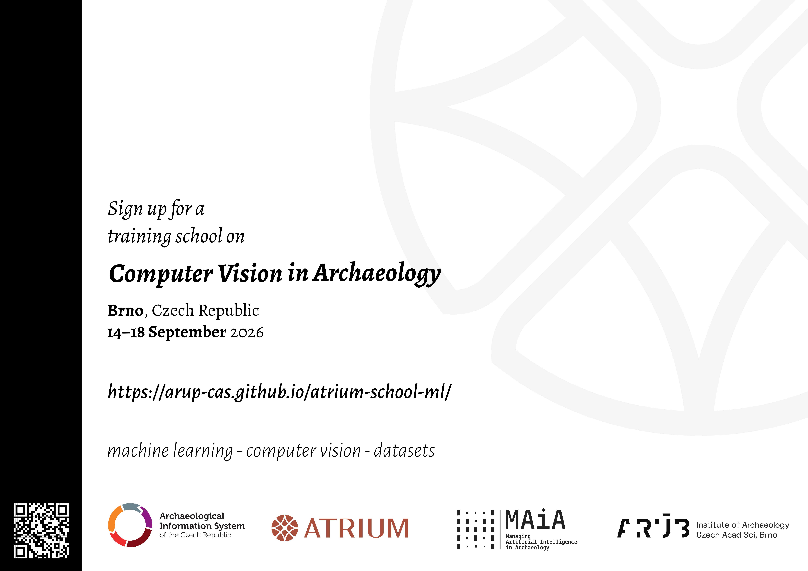

::: {.callout-note}

### Basics

**When?** 14–18 September 2026  
**Where?** Brno, Czech Republic  
**What?** Training school on computer vision and machine learning in archaeology

:::

::: {.justify}
Join us for an intensive one-week training school dedicated to **computer vision in archaeology**, where you will learn how to harness the power of modern machine learning techniques to detect, classify, and analyse archaeological features and artefacts in images. 
As visual data — from drone surveys and excavation photography to museum collections — continues to grow in volume, the ability to process and interpret it computationally is becoming an increasingly valuable skill in the archaeologist's toolkit. 
Our programme guides you from the very foundations of Python programming through to hands-on experience with state-of-the-art object detection and image segmentation models, with dedicated sessions on dataset creation, model training, and evaluation. 
Participants should have basic experience with any programming or markup language and a general comfort with working in digital environments. 
No prior experience with machine learning is required, but curiosity and a willingness to engage with technical material are essential.
:::

<!-- ## Abstract

::: {.justify}
This training school provides a structured five-day introduction to computer vision methods and their application in archaeological research. 
The programme covers Python programming for image analysis tasks, the preparation and annotation of image datasets in standard formats, and the configuration and training of object detection and segmentation models. 
Participants are introduced to common annotation workflows and data standards. 
The latter part of the school addresses model evaluation metrics, transfer learning, and an overview of current developments in vision-language models and their potential relevance to archaeological practice. 
The school is aimed at early-career researchers in archaeology having basic experience with any programming or markup language and a general comfort with working in digital environments. 
No prior experience with machine learning is required, but curiosity and a willingness to engage with technical material are essential.
::: -->

<!-- [{fig-align="center" width=60%}](https://atrium-research.eu) -->

:::: {.columns}
::: {.column width=50%}

:::
::: {.column width=10%}
:::
::: {.column width=40%}

:::
::::

:::: {.columns}
::: {.column width=40%}

:::
::: {.column width=10%}
:::
::: {.column width=50%}

:::
::::

::: {.justify}
The training school is part of a trans-national access scheme provided by the [ATRIUM Project](https://atrium-research.eu){.external}, hosted by the [Archaeological Information System of the Czech Republic (AIS CR)](https://aiscr.cz/){.external} research infrastructure at the [Institute of Archaeology, Czech Academy of Sciences, Brno](https://arub.cz/){.external}. 
The school is co-organized by the [MAIA COST Action](https://www.maiacost.eu/){.external} project. MAIA provides funding to several of the school instructors.

To apply and learn more about the TNA, visit the [ATRIUM TNA Application website](https://atrium-research.eu/tna-summer-schools/){.external}.
:::

[{.shadow}](flyer/school-ml_A4.png)
