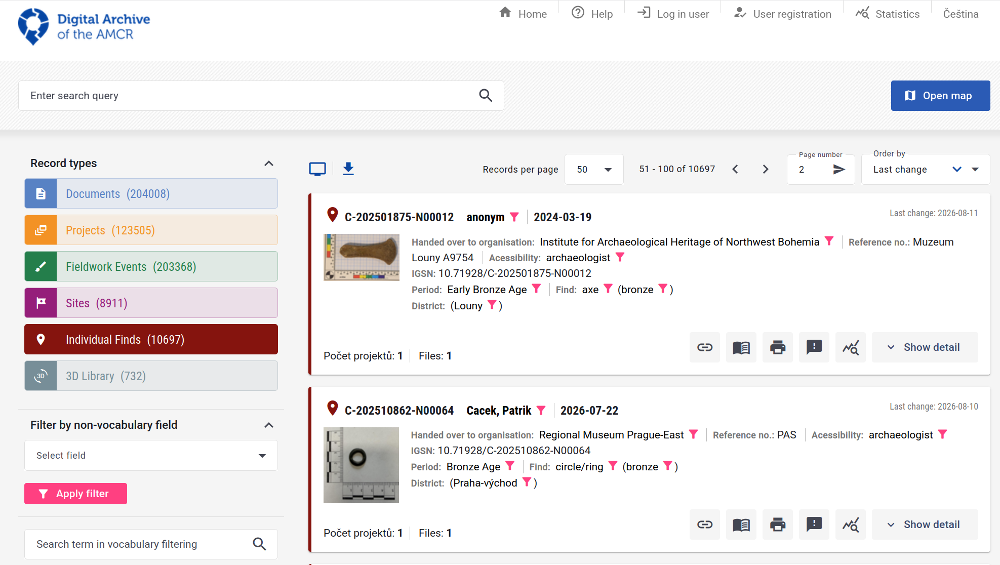
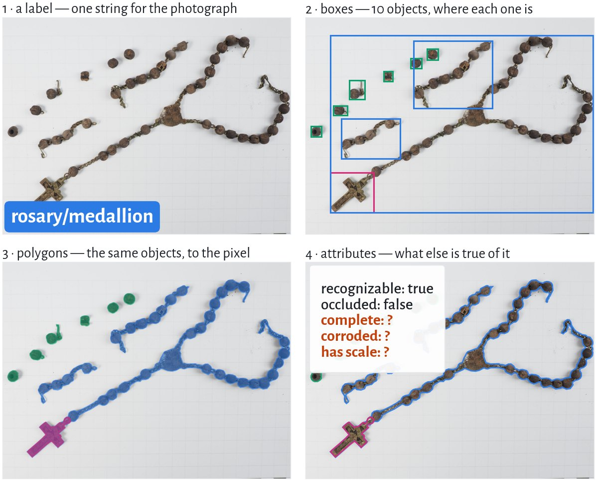
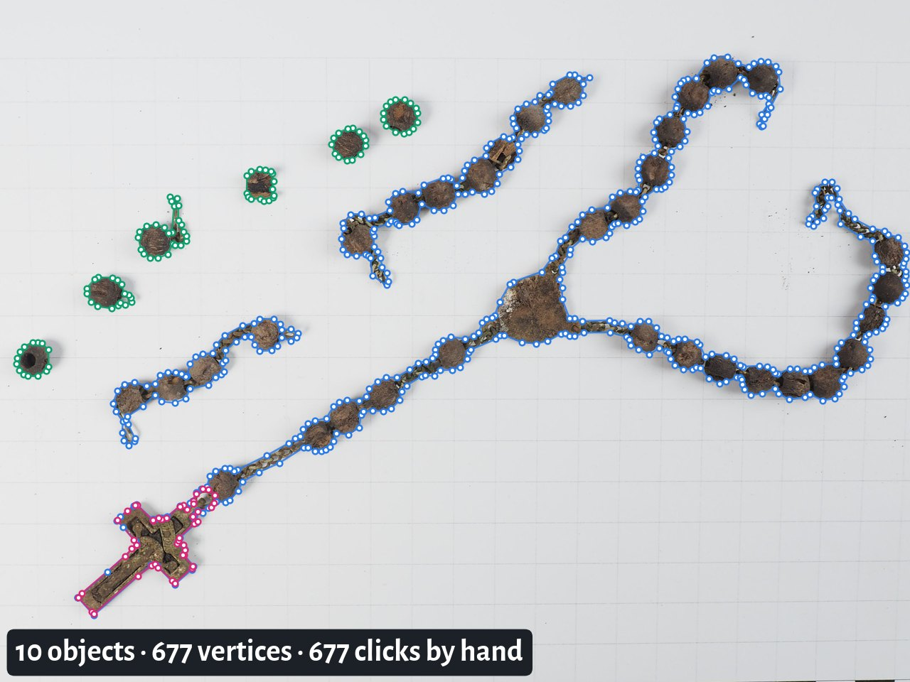
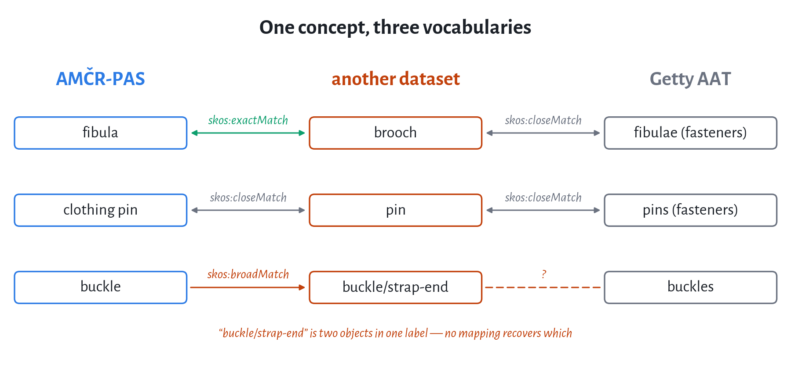

```{r}
#| label: setup
#| include: false
library(dplyr)
library(ggplot2)
library(readr)

knitr::opts_chunk$set(echo = FALSE, warning = FALSE, message = FALSE,
                      dev = "ragg_png", dpi = 200)

# Aggregates only — the 18 MB COCO export stays in temp/, out of the repository.
# Regenerate with:  python3 materials/artefacts/make_images.py
counts <- readr::read_csv("data/category_counts.csv", show_col_types = FALSE)
summ <- readr::read_csv("data/dataset_summary.csv", show_col_types = FALSE) |>
  (\(d) setNames(as.list(d$value), d$key))()

# Fall back cleanly on a machine without the font (or without systemfonts).
FAM <- tryCatch(
  if ("Alegreya Sans" %in% systemfonts::system_fonts()$family) "Alegreya Sans" else "sans",
  error = function(e) "sans")
BLUE <- "#2c7be5"
ORANGE <- "#c2410c"
INK  <- "#1c2128"
MUTE <- "#6b7280"
```

## The plan

::: {.smaller}
| | | |
|---:|---|---:|
| **1** | The **artefacts dataset** — where the photographs come from | |
| **2** | What **"annotated"** means · **COCO**, YOLO, Pascal VOC | |
| **3** | Annotation tools · live **demo** of CVAT with SAM 2 | |
| **4** | [**You annotate**, in your own CVAT project]{.disc} | *16 minutes* |
| **5** | [What **you** had to decide]{.disc} | *discussion* |
| **6** | **Three problems** — imbalance · vocabularies · missing metadata | |
| **7** | [**ArchaeoTag** — everyone plays a round]{.disc} | *phones out* |
| **8** | [**Discussion** — your dataset, your label set]{.disc} | *groups 1 & 2 report* |

: {tbl-colwidths="[10,64,26]"}
:::

::: {.fragment}
> Half of this session is you working, not me talking.
:::

::: {.notes}
Say the shape out loud. The single most important line is number 4: they will have
annotated something before the break, and block 5 is about decisions they themselves
just made.
:::

## Yesterday's number

:::: {.columns}
::: {.column width="46%"}
::: {.box .box-plain}
[80%]{.stat}

have **never used an image annotation tool**.
:::
:::
::: {.column width="52%"}
::: {.incremental}
- It is probably the **largest single cost** in every project we look at this week
- It is the one place where **your expertise**, not the model's, decides the outcome
- And it is where the decisions that sink a project get made — quietly, early, by whoever built the label set
:::
:::
::::

<!-- ::: {.fragment}
::: {.callout-important}
## By 10:30
You will have annotated a real archaeological dataset, and we will look at where
the room **disagreed with itself**.
:::
::: -->

::: {.notes}
Do not oversell. The point of the hands-on is not that they learn a tool — it is
that they feel how much interpretation is packed into one click, and see the
disagreement in their own data ten minutes later.
:::

# The artefacts dataset {background-color="#111111"}

## Where these photographs come from

::: {.incremental}
- A **detectorist** finds an object in a field
- They report it — findspot, a photograph, sometimes a guess at what it is and some other metadata
- An **archaeologist** checks the record and assigns/confirms a type from a controlled list
- The photograph lands in **AMČR-PAS**, the public portal of the [Archaeological
  Information System of the Czech Republic](https://www.aiscr.cz/){.external}
- Explore the data and images in the [Digital archive of the Archaeological Map of the Czech Republic](https://digiarchiv.aiscr.cz/results?entity=samostatny_nalez&sort=datestamp%20desc&page=0){.external}
:::

::: {.fragment}
::: {.callout-note}
Every step in that chain is a **filter**. Hold on to that — it comes back in problem 1.
:::
:::

::: {.aside}
AMČR-PAS: [amcr-info.aiscr.cz](https://amcr-info.aiscr.cz){.external}. Photographs are published
under CC BY-NC 4.0 with an IGSN (a DOI) per record.
:::

::: {.notes}
Three filters worth naming out loud if a question comes: what the detector beeps at,
what a finder thinks is worth reporting, and what survives in the ground at all.
Do not develop it here — it is the imbalance slide's job.
:::

##

[Digital Archive of the AMCR -- Individual finds selected](https://digiarchiv.aiscr.cz/results?entity=samostatny_nalez&sort=datestamp%20desc&page=1){.external}

{}

## What is in our dataset?

:::: {.columns}
::: {.column width="32%"}
::: {.box .box-plain}
[`r format(summ$images, big.mark = " ")`]{.stat}

photographs
:::
:::
::: {.column width="32%"}
::: {.box .box-plain}
[`r format(summ$annotations, big.mark = " ")`]{.stat}

annotations
:::
:::
::: {.column width="32%"}
::: {.box .box-plain}
[`r summ$categories_used`]{.stat}

artefact types used
:::
:::
::::

::: {.fragment}
::: {.smaller}
- Every annotation is a **polygon**, not just a box — `r format(summ$annotations, big.mark = " ")` of them
- `r summ$categories_declared` types are **declared** in the file; `r summ$categories_never_used` of them
  are **never used once**
<!-- - `r summ$images - summ$images_with_annotations` photographs carry **no annotation at all** -->
- One photograph carries as many as **`r summ$max_annotations_per_image`** objects
:::
:::

::: {.fragment}
This is a real working dataset, with all the untidiness that implies. **We will open the actual file in a minute.**
:::

::: {.notes}
The 95 declared-but-unused categories are the most revealing number here. They come
from the national thesaurus: the vocabulary was designed for the whole archaeological
record, and this dataset only ever sees the part of it that a detectorist finds.
:::

# What "annotated" means {background-color="#111111"}

## Four things people mean by it

::: {.figure .figure-xl}
{fig-alt="One photograph of a rosary at four levels of annotation: an image-level label, ten bounding boxes, ten filled polygons, and the polygons with an attribute panel listing recognizable and occluded, and three unanswered fields: damage, fragment and scale."}

[Rosary: AMČR [M-202400071-N00083](https://doi.org/10.71928/M-202400071-N00083), CC BY-NC 4.0]{.credit}
:::

::: {.smaller}
Same photograph, same objects. **The annotation is a choice, and it is the expensive one.**
:::

::: {.notes}
Walk left to right, top to bottom, one sentence each. Then the question: which of the
four do you need? The honest answer is almost always "one level less than you assumed".
The orange fields in panel 4 are deliberate — they are the ArchaeoTag hook, come back to them.
:::

## The task shape sets the cost

::: {.smaller}
| You want | You annotate | Roughly, per image |
|---|---|---|
| *what is in this photograph?* | one **label** | seconds |
| *how many, and where?* | a **box** per object | tens of seconds |
| *what is its exact outline / area?* | a **polygon** per object | minutes |
| *what condition is it in?* | **attributes** per object | seconds — if you decided the fields in advance |
:::

::: {.fragment}
::: {.callout-warning}
## The order matters
Going from boxes to polygons **after** you have annotated 2 000 images means
annotating 2 000 images again. Going the other way is free.
:::
:::

::: {.fragment}
Yesterday: *the task shape follows from the question*. Today: **and the question has a price.**
:::

::: {.notes}
This is the slide to slow down on. If they take one thing from the morning it is
that the annotation schema is a commitment, not a setting, and it is made before
anyone has trained anything.
:::

## COCO: four keys and a convention

::: {.smaller}
```json
{
  "info":        { ... },
  "licenses":    [ ... ],
  "images":      [ {"id": 1, "file_name": "...", "width": 3978, "height": 2762}, ... ],
  "categories":  [ {"id": 1, "name": "adornment"}, {"id": 63, "name": "fibula"}, ... ],
  "annotations": [ {"image_id": 1, "category_id": 63, "bbox": [...], "segmentation": [...]}, ... ]
}
```
:::

::: {.incremental}
- **One file** for the whole dataset — images, label set and annotations together
- `annotations` point at `images` and `categories` **by id**, so nothing is repeated
- It carries **boxes and polygons in the same record**, which is why it is the default
:::

::: {.fragment}
::: {.callout-tip}
*Common Objects in Context* — a benchmark dataset from 2014 whose **file layout** outlived it and became the de-facto interchange format.
:::
:::

::: {.notes}
Open the real file on screen now, not after the slide: `categories` first, then find
the rosary in `images`, then filter `annotations` by its id. Let them watch you get
lost for a second — that is the honest experience of a COCO file.
:::

## One annotation, as it really is

:::: {.columns}
::: {.column width="58%"}
::: {.smaller}
```json
{
  "categories": [
    {"id": 58, "name": "cross"}, …
  ],
  "images": [
    {"id": 8987, "file_name": "…/M202400071N00083F01.jpeg",
     "width": 3978, "height": 2762}, …
  ],
  "annotations": [
    {"id": 9872, "image_id": 8987, "category_id": 58,
     "bbox": [837.8, 1760.0, 485.2, 445.9],
     "area": 216350.7,
     "segmentation": [[1301.3, 1762.7, 1279.0, 1760.0, …]],
     "iscrowd": 0,
     "attributes": {"recognizable": "true", "occluded": false}}, …
  ]
}
```
:::
:::
::: {.column width="40%"}
::: {.smaller}
- `image_id` points into `images`, `category_id` into `categories` — the three lists are joined **only by id**
- `bbox` is **x, y, width, height** — corner, not centre
- `segmentation` is one **flat** list: `x1 y1 x2 y2 …`, here **47** vertices
- `category_id` is just **`58`**. The word *cross* lives only in `categories`
- `attributes` is **not** standard COCO — the tool added it
:::
:::
::::

<!-- ::: {.fragment}
::: {.callout-warning}
Four of those fields are places where two tools disagree about what the numbers mean.
:::
::: -->

::: {.notes}
The `attributes` key is the important one: it is an extension, it round-trips through
CVAT and Label Studio but not through most training code. That is the general lesson —
the useful archaeological metadata is exactly the part the format does not standardise.
:::

## The same annotation, three formats

:::: {.columns}
::: {.column width="55%"}

::: {.smaller}
**COCO** · one JSON file for the whole dataset

```{.json filename="amcr-pas_v0.json · one entry of annotations"}
{"id": 9872, "image_id": 8987, "category_id": 58,
 "bbox": [837.8, 1760.0, 485.2, 445.9],
 "segmentation": [[1301.3, 1762.7, 1279.0, 1760.0, …]]}
```

`bbox` is the top-left corner plus width and height, in pixels. **The polygon is
kept.** The image and the class name are found only by id.
:::

::: {.smaller}
**YOLO** · one `.txt` per image, one line per object

```{.text filename="labels/M202400071N00083F01.txt"}
57 0.271594 0.717940 0.121971 0.161441
```

```{.yaml filename="data.yaml"}
names: {…, 57: cross, …}
```

Class, then centre x, y, width, height ÷ image size. 0-based, so **58 becomes 57**;
*cross* is only in `data.yaml`. **The polygon is gone.**
:::

:::
::: {.column width="45%"}

::: {.smaller}
**Pascal VOC** · one `.xml` per image

```{.xml filename="Annotations/M202400071N00083F01.xml"}
<annotation>
  <filename>M202400071N00083F01.jpeg</filename>
  <size><width>3978</width> <height>2762</height></size>
  <object>
    <name>cross</name>
    <bndbox>
      <xmin>838</xmin> <ymin>1760</ymin>
      <xmax>1323</xmax> <ymax>2206</ymax>
    </bndbox>
  </object>
</annotation>
```

The box is two corners, in whole pixels. **The class name is written out**, and the
file names its own image. **The polygon is gone.**
:::

:::
::::

::: {.fragment}
::: {.callout-important}
Every conversion is **lossy in a different direction** — and `57` means nothing
without the `data.yaml` it came with.
:::
:::

::: {.notes}
If time is short, skip VOC and compare the two blocks on the left — the normalisation
and the lost class name are the two things worth their slide space.

YOLO also has a segmentation variant that keeps polygons (normalised `x y` pairs after
the class), so "the polygon is gone" is true of the detection format shown here.
:::

# Annotation tools {background-color="#111111"}

## Four tools, one job

| Tool | Runs | Good for |
|---|---|---|
| **CVAT** — [cvat.ai](https://www.cvat.ai){.external} | a server, or cvat.ai | images and video, a team, **SAM 2 built in** · *what we use today* |
| **Label Studio** — [labelstud.io](https://labelstud.io){.external} | a server | any data type — text, audio, time series as well as images |
| **VIA** — [VGG Image Annotator](https://www.robots.ox.ac.uk/~vgg/software/via/via_demo.html){.external} | one HTML file in your browser | a small set, one person, no install, works offline |
| **makesense.ai** — [makesense.ai](https://www.makesense.ai/){.external} | in your browser | quick boxes and polygons, no account, images stay on your computer |

: {tbl-colwidths="[30,24,46]"}

::: {.fragment}
> They all do the same thing: **shapes, classes, attributes → a file**. Pick by team size
> and data type, and check the export formats before you start.
:::

::: {.notes}
One minute, no demos of the other three. The point is that the tool is the least
important decision of the session: the label set and the definitions matter more, and
every one of these writes COCO or something close to it.

VIA is the one to recommend to anyone with a few hundred photos and no server: a single
file, nothing to install. Open the demo link if someone asks.
:::

## CVAT: the demo

:::: {.columns}
::: {.column width="50%"}
**Why CVAT today**

- Built for **images and video**
- **Projects → tasks → jobs**, split across people
- **SAM 2** one click away, under AI Tools
:::
::: {.column width="48%"}
**Live — the steps you will do next**

::: {.incremental}
1. Create a project and paste in `labels.json`: the classes and the three questions
2. Create a task from the photographs
3. Outline one find with SAM 2, give it a class, answer its questions
4. Export as COCO and open the JSON
:::
:::
::::

::: {.fragment}
> `labels.json` *is* the schema. If you can read it, you know exactly what the dataset
> will contain.
:::

::: {.fragment}
::: {.callout-note}
The AMČR-PAS annotations you have been looking at were made in **CVAT** — that is where
`recognizable` and `occluded` come from.
:::
:::

::: {.notes}
Live, five minutes. Do exactly the steps they are about to do — the setup slide after
this repeats them — on the rosary (`temp/annotation/demo/`). Resist the urge to tour the
interface.

Export as COCO 1.0: the polygon and the attributes are both in the JSON, which is where
our dataset's `attributes` came from. If there is a minute, export a YOLO format as well
and open the `.txt`: a number and four coordinates, no attributes, no class name. That is
the three-formats slide happening in front of them.

Worth saying: CVAT forces a default on every attribute, which is why ours start at `?`.
Without that, an untouched object looks like an answer. The `occluded` flag is CVAT's own
per-shape switch, off unless someone turns it on, and it is `false` on all
`r format(summ$annotations, big.mark = " ")` annotations in the export.
:::

## Why a polygon hurts

::: {.figure .figure-xl}
{fig-alt="The rosary photograph with every polygon vertex of all ten annotations drawn as a small circle; the caption reads 10 objects, 677 vertices, 677 clicks by hand."}

[Rosary: AMČR [M-202400071-N00083](https://doi.org/10.71928/M-202400071-N00083), CC BY-NC 4.0]{.credit}
:::

::: {.smaller}
**One photograph.** At `r format(summ$annotations, big.mark = " ")` annotations across the
collection, that is the scale of what somebody already did by hand.
:::

::: {.notes}
Let this one sit for a beat before saying anything. The dots do the argument. Then:
this is why model-assisted annotation is not a luxury.
:::

## SAM 2: click instead of trace

::: {.incremental}
- A **foundation model for segmentation** — it has no idea what a fibula is, and does
  not need one
- You give it a **point, a box or a scribble**; it returns a mask
- It is **class-agnostic**: it finds the boundary, **you** supply the label
- In CVAT it is under **AI Tools → Interactors**: click the object, right-click what
  should be left out, then correct the result
:::

::: {.fragment}
::: {.callout-warning}
## Watch it fail
A corroded find on a background close to its own tone, and the mask leaks into the
scale bar. **Model-assisted is not model-decided** — correcting a bad mask can cost
more than drawing a good one.
:::
:::

::: {.notes}
Live: one clean find (instant, convincing), then deliberately a corroded one on the
grey card. Show the mask leaking, fix it with a negative point, and say the honest
number — assisted annotation is perhaps three to five times faster on easy objects and
no faster at all on hard ones.
:::

# Your turn {background-color="#111111"}

## CVAT, on our server

::: {.address}
[[http://]{.address-scheme}10.10.1.40:8081](http://10.10.1.40:8081/){.external}
:::

::: {.address-note}
Type it into your browser. It is a local address — it works only on the network here.
:::

::: {.notes}
Leave this slide up while people type the address; read it out once, digit by digit.
If a browser complains, check that it kept `http://` and did not switch to `https://`.
:::

## Set up your project {.discussion}

**About 5 minutes. Everyone works on the same 10 photographs, each in their own project.**

::: {.smaller}
1. Open **CVAT** at **`http://10.10.1.40:8081`** → **Create an account**
2. **Pull** the lessons repository — everything is in **`2-tuesday-artefacts/`**
3. **Projects → + → Create a new project** · give it a name · open the **Raw** tab ·
   replace everything in it with the contents of `labels.json` · **Done** · **Submit & Open**
4. In the project: **+ → Create a new task** · give it a name · add the ten files from
   `images/` under **Select files** · **Submit & Open**
5. Click the **job** in the task — that opens the first photograph
:::

::: {.fragment}
::: {.callout-tip}
Stuck on step 3? The Raw tab must contain **only** `labels.json` — one `[` at the start,
one `]` at the end.
:::
:::

::: {.notes}
CVAT's address is on the previous slide and in step 1; put it on the board as well, as a
QR code if you can. The files are in
[atrium-school-ml-lessons](https://github.com/arubrno/atrium-school-ml-lessons), folder
`2-tuesday-artefacts/`: `images/` (the ten photographs, not the demo rosary),
`labels.json`, and `credits.csv`; its README repeats these steps. Anyone who never cloned
the repository can download it as a ZIP from GitHub (**Code → Download ZIP**).

Walk the room during setup. Step 3 is where people get stuck: pasting `labels.json` after
the `[]` that is already in the Raw box, instead of replacing it. Most people are done in
three to five minutes; start the clock on the next slide when about two thirds of the
room are looking at a photograph.
:::

## Annotate {.discussion}

**16 minutes. Everything after this slide is about decisions you make now.**

:::: {.columns}
::: {.column width="54%"}
::: {.incremental}
1. Outline each artefact — **SAM 2**, polygon or box — and give it a **class**
2. In the **objects list**, answer **fragment** and **damage**
3. Whole photo: **Setup tag → photo**, answer **scale**
4. Not sure? **Annotate it anyway**, say why in **note**
5. **Save** (Ctrl+S), next photo
:::
:::
::: {.column width="44%"}
::: {.box .box-plain}
[fragment]{.box-title}
a piece of an object, not a whole one?
:::
::: {.box .box-plain}
[damage]{.box-title}
none, minor or major?
:::
::: {.box .box-plain}
[scale]{.box-title}
is there a scale bar in the frame?
:::
:::
::::

::: {.fragment}
::: {.callout-tip}
Do not compare with your neighbour. **We will talk about what you decided, and why.**
:::
:::

::: {.notes}
Everyone annotates in their own project, so nothing is shared and nothing is compared on
screen afterwards — the next block is a discussion. Walk the room; note which photographs
people hesitate on, and on 04, 06 and 08 what they chose. Those are what you ask about next.

The scale question is a tag on the whole photo, not on an object: people will miss it.
Point at the tag button once, early. Give a two-minute warning at 14.
:::

## What you had to decide {.discussion}

::: {.box .box-disc}
[hands up]{.box-title}
Photo **04**: coin or pendant? · Photo **06**: mount or pendant? · Photo **08**: one object, or several?
:::

::: {.incremental}
- Your **outlines** will be close — SAM 2 saw to that
- Your **classes** will not, on two or three of the photographs — deliberately so
- Your **attributes** even less: *fragment* and *damage* are judgements nobody defined
  for you — is a broken fibula a fragment, or damaged?
:::

::: {.fragment}
> SAM made your outlines agree. It could not make your meanings agree — and that is the
> disagreement inside every archaeological dataset you will ever download.
:::

::: {.notes}
No screens: a show of hands per photograph is enough to make the split visible, and
nobody's work is on display. Go through the planted ones:

- **04**, a pierced coin, recorded in AMČR as a *pendant*
  ([M-202101534-N00375](https://doi.org/10.71928/M-202101534-N00375))
- **06**, a crescent, recorded as a *mount*, which most people will call a pendant
  ([M-202300130-N00146](https://doi.org/10.71928/M-202300130-N00146))
- **08**, coins fused into a corroded lump: one object or several, *coin* or *amorphous*?
  ([M-202105567-N00005](https://doi.org/10.71928/M-202105567-N00005))

The AMČR recorder's own answer for each is in `annotation/images.csv`. Ask the people who
disagreed to say why — out loud, without defending themselves. The answers are always
about the *definition*, never about the photograph.
:::

## Agreement is a measurement

::: {.incremental}
- If two people disagree on 15% of images, **no model trained on it can do better than 85%** —
  the ceiling is in the data, not the architecture
- Measure it: annotate an overlap set **twice**, report **Cohen's κ** (two annotators) or
  **Fleiss' κ** (more)
- Where κ is low, the fix is **not more annotators**. It is a better definition, with
  pictures of the edge cases
:::

::: {.fragment}
::: {.callout-important}
An annotation guide with worked examples of the **hard** cases is worth more than
doubling your training set.
:::
:::

::: {.notes}
Do not teach the kappa formula. The claim that matters is the ceiling: it reframes
"our model only gets 82%" from a modelling problem into a data problem, which is where
it usually belongs.

If someone asks what a better definition looks like, our schema has one. `damage` is
defined by what you can see: *minor* is mild corrosion or scars, *major* is heavy
corrosion with contours you cannot identify. It also says outright that `fragment` is
**distinct from** `damage`, which settles the broken-fibula argument from the last slide.
:::

# Three problems {background-color="#111111"}

## 1 · What the ground gives you

```{r}
#| label: chart-longtail
#| fig-width: 11.4
#| fig-height: 3.5
top <- counts |> slice_head(n = 12)
rest <- counts |> slice_tail(n = nrow(counts) - 12)
d <- bind_rows(top, tibble(category = paste(nrow(rest), "other types"),
                           n = sum(rest$n), pct = sum(rest$pct)))
d$category <- factor(d$category, levels = rev(d$category))
d$hi <- d$category %in% c("fibula", "coin")

ggplot(d, aes(n, category, fill = hi)) +
  geom_col(width = 0.7) +
  geom_text(aes(label = paste0(format(n, big.mark = " "), "  (", round(pct), "%)")),
            hjust = -0.14, family = FAM, size = 3.4, colour = MUTE) +
  scale_fill_manual(values = c(`TRUE` = ORANGE, `FALSE` = BLUE), guide = "none") +
  scale_x_continuous(expand = expansion(mult = c(0, 0.22))) +
  labs(x = NULL, y = NULL) +
  theme_minimal(base_family = FAM, base_size = 13) +
  theme(panel.grid = element_blank(), axis.text.x = element_blank(),
        axis.text.y = element_text(colour = INK, size = 11.5, hjust = 1),
        plot.margin = margin(2, 6, 2, 2))
```

::: {.smaller}
**Fibulae and coins are `r summ$fibula_coin_pct`% of every annotation in the dataset.**
:::

::: {.notes}
Do not read the bars. One sentence: two classes out of a hundred and twelve hold
two fifths of the data, and that is before you ask whether the other hundred are
usable at all.
:::

## The tail is the dataset

:::: {.columns}
::: {.column width="52%"}
```{r}
#| label: chart-cumulative
#| fig-width: 5.4
#| fig-height: 3.0
cum <- counts |> mutate(i = row_number(), cum = cumsum(pct))
ggplot(cum, aes(i, cum)) +
  geom_area(fill = BLUE, alpha = 0.13) +
  geom_line(colour = BLUE, linewidth = 1.1) +
  geom_segment(x = 12, xend = 12, y = 0, yend = cum$cum[12],
               colour = ORANGE, linewidth = 0.6, linetype = "22") +
  annotate("text", x = 15, y = cum$cum[12] - 9, hjust = 0, family = FAM, size = 3.6,
           colour = ORANGE, label = paste0("12 types = ", round(cum$cum[12]), "%")) +
  scale_x_continuous(expand = expansion(mult = c(0.01, 0.02))) +
  scale_y_continuous(limits = c(0, 100), expand = expansion(mult = c(0, 0.02)),
                     labels = function(x) paste0(x, "%")) +
  labs(x = "artefact types, most frequent first", y = NULL) +
  theme_minimal(base_family = FAM, base_size = 12) +
  theme(panel.grid.minor = element_blank(),
        panel.grid.major.x = element_blank(),
        axis.title.x = element_text(colour = MUTE, size = 10),
        axis.text = element_text(colour = MUTE))
```
:::
::: {.column width="46%"}
::: {.smaller}
- **`r summ$categories_under_50`** of the `r summ$categories_used` types have fewer than
  **50** annotations — together, `r summ$under_50_pct`% of the data
- **`r summ$categories_never_used`** types are in the label set and have **never been seen**
- A model trained on this learns `r summ$categories_used - summ$categories_under_50` types
  well and the rest **not at all**
:::

::: {.fragment}
::: {.box .box-gen}
A classifier that ignores the image and always answers *fibula* scores
**`r round(counts$pct[1])`%**. Always *fibula or coin*: **`r summ$fibula_coin_pct`%**.
:::
:::
:::
::::

::: {.notes}
The always-fibula baseline is the one number to make them write down. Any reported
accuracy on an imbalanced set has to be compared against it, and a surprising number
of published figures are not.
:::

## This is reporting bias, not the past

::: {.incremental}
- Metal detectors find **metal** — a fibula beeps, a potsherd does not
- Finders report what looks like **a find**: complete, decorated, recognisable
- Recorders assign the type they are **confident** about, and *amorphous fragment* when not
- Archives digitise what is already **catalogued**
:::

::: {.fragment}
::: {.callout-important}
`r summ$fibula_coin_pct`% fibulae and coins is a fact about **detectorists, reporting and
archives**. It is not a fact about what was in the ground.
:::
:::

::: {.fragment}
A model trained here learns the **collection process** at least as well as it learns the artefacts.
:::

::: {.notes}
This is the intellectual centre of the session. Connect it back to the filter chain from
the second slide of the deck — they have now seen the number the filters produce.
:::

## 2 · Your labels are not their labels

::: {.figure .figure-xl}
{fig-alt="Three columns of artefact terms — AMČR-PAS, another dataset, Getty AAT — joined by arrows labelled skos:exactMatch, skos:closeMatch and skos:broadMatch, with one row where a combined buckle/strap-end label cannot be mapped back."}
:::

::: {.smaller}
You want to combine two datasets, or test a model trained on one against the other.
**Nothing lines up, and the places it does not are not obvious.**
:::

::: {.notes}
The identifiers behind these boxes need checking against the live vocabularies before
this slide is shown — the terms are real, the mappings are the argument. See the
prerequisites in the session plan.
:::

## SKOS, in three predicates

::: {.smaller}
| | means | safe to do |
|---|---|---|
| `skos:exactMatch` | interchangeable in **any** context | merge the two classes |
| `skos:closeMatch` | interchangeable in **some** contexts | merge, and say so in the paper |
| `skos:broadMatch` / `narrowMatch` | one is **wider** than the other | roll the narrow one up; never down |
| `skos:relatedMatch` | associated, **not** substitutable | do not merge |
:::

::: {.fragment}
::: {.callout-warning}
## `closeMatch` does not chain
*A closeMatch B* and *B closeMatch C* says **nothing** about A and C. Two hops through
a crosswalk and you have a class that means whatever the path happened to be.
:::
:::

::: {.fragment}
::: {.smaller}
SKOS is a W3C standard for publishing exactly this: concepts with stable URIs, their
labels in several languages, and typed links between vocabularies.
:::
:::

::: {.notes}
`exactMatch` is transitive, `closeMatch` deliberately is not — that asymmetry is the
whole practical content of the slide. If someone asks about OWL `sameAs`: SKOS is about
concepts, not individuals, which is why it fits vocabularies and OWL does not.
:::

## What a crosswalk buys you

::: {.incremental}
- A **shared coarse level** — *fibula*, *pin*, *buckle* map cleanly; *buckle/strap-end* does not
- Training on the union of two collections, honestly, with the merge **written down**
- Evaluating a Czech-trained model on British data without silently renaming anything
:::

::: {.fragment}
::: {.callout-note}
## The realistic outcome
You will lose resolution. Two datasets at 112 and 90 types may share **30** that map
`exactMatch`. That is still a far better dataset than either alone — and the mapping is
a research output in its own right.
:::
:::

::: {.notes}
Emphasise "written down". The difference between a defensible merged dataset and a
mess is a published mapping file, not the merging itself.
:::

## 3 · The metadata nobody has time for

:::: {.columns}
::: {.column width="54%"}
What the file records:

::: {.smaller}
```json
"attributes": {
  "recognizable": "true",
  "occluded": false
}
```
:::

::: {.fragment}
::: {.smaller}
::: {.incremental}
- Every one is a **seconds-long judgement** — and `r format(summ$annotations, big.mark = " ")` × several seconds is weeks of somebody's time
- None of it needs a specialist. **Anyone can see** whether an object is broken or whether there is a ruler in the frame
- Which makes it exactly the kind of work you can **ask a crowd** to do
:::
:::
:::
:::
::: {.column width="44%"}
What the schema asks for:

::: {.smaller}
```json
"attributes": {
  "type":           ?,
  "context":        ?,
  "view":           ?,
  "recognizable":   true,
  "damage":         ?,
  "fragment":       ?,
  "iconic":         ?,
  "group":          ?,
  "occluded":       false,
  "truncated":      ?,
  "composite":      ?,
  "scale":          ?,
  "colorReference": ?,
  "markup":         ?
}
```
:::
:::
::::

::: {.notes}
Land the contrast: the polygons needed an expert and cost 677 clicks a photograph;
these fields need no expertise at all and are the ones missing. That asymmetry is the
argument for the next slide.

The right-hand block is the schema ArchaeoTag collects into (`imagetag_schema.json` in
arubrno/archiv-digilab): fourteen fields. The COCO export predates it, and it has two.
Even those two are thinner than they look: `occluded` is `false` on every one of the
`r format(summ$annotations, big.mark = " ")` annotations. It is CVAT's own per-shape
switch, off unless someone turns it on, so it records a default, not a judgement.
:::

# ArchaeoTag {background-color="#111111"}

## Guess what this is {.discussion}

**Phones out. Open the URL on the board — three minutes of play.**

::: {.incremental}
- You are shown a **photograph of a find** and asked what it is
- Along the way you answer the easy questions: *a fragment? damaged? is there a scale?*
- You find out whether you were right — that is the game
- We get a **crowd-sourced answer** to the fields the file does not have
:::

::: {.fragment}
::: {.callout-tip}
The guessing is the incentive. The **metadata is the point**, and nobody playing has to care.
:::
:::

::: {.notes}
Three minutes of play, then stop them firmly — they will not want to stop. Have the
results view ready on the projector before you start.
:::

## What a guess is worth

::: {.incremental}
- **One** guess is noise. **Twenty** guesses on the same photograph is a distribution
- Where players agree, you have a usable attribute at effectively **zero cost**
- Where they disagree, you have found a **genuinely ambiguous object** — which is worth
  knowing, and is exactly what you want an expert to look at
- Their guesses at the **class** are a free baseline: *how hard is this dataset for a human?*
:::

::: {.fragment}
> The same logic as the last hour: **disagreement is data**, not failure.
:::

::: {.fragment}
::: {.callout-warning}
Crowd labels are good for *is there a scale bar in this photograph*. They are not good
for *is this an Almgren 236 fibula*. Know which question you are asking.
:::
:::

::: {.notes}
Show the live results from the round they just played. If agreement on some attribute
is poor, say so — it is the honest version of the same point they met in block 5.
:::

# Discussion {background-color="#111111"}

## Your dataset, your label set {.question .discussion}

**8 minutes in your group. Groups 1 & 2 report back.**

::: {.incremental}
1. Take **one dataset** somebody in the group works with. What are its **classes** — and
   **who decided** them?
2. What is the **annotation bill**? Number of images × the level you actually need. Give us
   **hours**.
3. What in that dataset is **over-represented for reasons that have nothing to do with the
   past** — how it was collected, who reported it, what survives?
4. Which **attributes** would you want that nobody has recorded? Could a stranger answer them?
:::

::: {.fragment}
::: {.callout-note}
Question 2 in hours, out loud. It is usually the moment a project's scope becomes visible.
:::
:::

::: {.notes}
Push hard on (3) — every dataset in the room has one and most people have never named it.
The answers feed straight into this afternoon's project presentations, so write them down.
:::

## Reporting back

Groups 1 & 2, then anyone with a good answer to (3):

::: {.incremental}
- The **dataset** and who decided its classes
- The **bill**, in hours
- The **bias** you named
:::

::: {.fragment}
::: {.callout-tip}
This afternoon is yours: **present your own data and problems**. Everything on this slide
is a good place to start from.
:::
:::

# Wrapping up {background-color="#111111"}

## Five things to carry into the week

::: {.incremental}
1. The **annotation schema is a commitment**, not a setting — boxes to polygons means starting again
2. Every format is **lossy in its own direction**; keep the COCO and export from it
3. **Disagreement between annotators is the ceiling** on any model you train
4. An imbalanced dataset describes **how it was collected** at least as much as what it contains
5. Labels are **local**. Mapping between vocabularies is real work, and worth publishing
:::

::: {.fragment}
### Next up

**This afternoon** — your own projects and datasets.
**Tomorrow** — microscopy, and what to do to images before a model ever sees them.
:::

## Where to read more {.smaller}

:::: {.columns}
::: {.column width="49%"}
**Tools**

- CVAT — [cvat.ai](https://www.cvat.ai){.external}
- Label Studio — [labelstud.io](https://labelstud.io){.external}
- VIA — [robots.ox.ac.uk/~vgg/software/via](https://www.robots.ox.ac.uk/~vgg/software/via/via_demo.html){.external}
- makesense.ai — [makesense.ai](https://www.makesense.ai/){.external}
- SAM 2 — [ai.meta.com/sam2](https://ai.meta.com/sam2/){.external}
- COCO format — [cocodataset.org/#format-data](https://cocodataset.org/#format-data){.external}
- SKOS primer — [w3.org/TR/skos-primer](https://www.w3.org/TR/skos-primer/){.external}
:::
::: {.column width="49%"}
**Data and vocabularies**

- AMČR-PAS — [amcr-info.aiscr.cz](https://amcr-info.aiscr.cz){.external}
- Getty AAT — [getty.edu/research/tools/vocabularies/aat](https://www.getty.edu/research/tools/vocabularies/aat/){.external}
- Portable Antiquities Scheme — [finds.org.uk](https://finds.org.uk){.external}
- ARIADNE — [ariadne-research-infrastructure.eu](https://ariadne-research-infrastructure.eu){.external}
:::
::::

::: {.aside}
Slides: [github.com/arup-cas/atrium-school-ml](https://github.com/arup-cas/atrium-school-ml) ·
Photographs: AMČR, CC BY-NC 4.0 ·
Licences: MIT (code) & CC BY-SA 4.0 International (other content), if not stated otherwise.
:::
