```{r}
#| label: setup
#| include: false
library(dplyr)
library(ggplot2)
library(readr)

knitr::opts_chunk$set(echo = FALSE, warning = FALSE, message = FALSE,
                      dev = "ragg_png", dpi = 200)

# Aggregates only — the raw survey export stays out of the repository.
# Regenerate with:  Rscript survey/aggregate.R
read_summary <- function(f) readr::read_csv(file.path("..", "survey", "summary", f),
                                            show_col_types = FALSE)

# Fall back cleanly on a machine without the font (or without systemfonts).
FAM <- tryCatch(
  if ("Alegreya Sans" %in% systemfonts::system_fonts()$family) "Alegreya Sans" else "sans",
  error = function(e) "sans")
BLUE <- "#2c7be5"
INK  <- "#1c2128"
MUTE <- "#6b7280"

# One measure across categories = one series = one colour for every bar.
# Values are direct-labelled at the bar end, so the x-axis is dropped entirely
# rather than repeating the same numbers twice.
p_bar <- function(d, sort = TRUE, pad = 0.30) {
  d$category <- if (sort) reorder(d$category, d$n) else factor(d$category, rev(d$category))
  ggplot(d, aes(n, category)) +
    geom_col(fill = BLUE, width = 0.68) +
    geom_text(aes(label = paste0(n, "  (", pct, "%)")), hjust = -0.18,
              family = FAM, size = 3.5, colour = MUTE) +
    scale_x_continuous(expand = expansion(mult = c(0, pad))) +
    labs(x = NULL, y = NULL) +
    theme_minimal(base_family = FAM, base_size = 13) +
    theme(
      panel.grid      = element_blank(),
      axis.text.x     = element_blank(),
      axis.text.y     = element_text(colour = INK, size = 12, hjust = 1),
      plot.title      = element_text(colour = INK, face = "bold", size = 13.5,
                                     margin = margin(b = 9)),
      plot.title.position = "plot",
      plot.margin     = margin(2, 6, 2, 2)
    )
}
```

## {.center}

::: {.logos}
[](https://www.atrium-research.eu)
[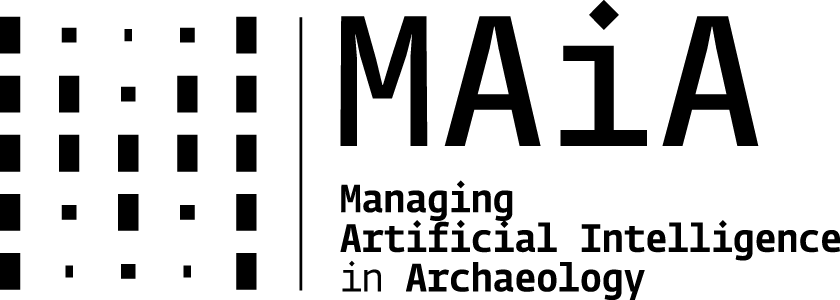](https://www.maiacost.eu/)
:::

::: {.logos .logos-small}
[](https://www.aiscr.cz/en/)
[](https://www.arub.cz/)
:::

<!-- ::: {.aside}
This training school is provided as transnational access under the **ATRIUM** project
(*Advancing Frontier Research in the Arts and Humanities*, Horizon Europe grant No. 101132163),
hosted by **AIS CR** at the **Institute of Archaeology, Czech Academy of Sciences, Brno**,
and co-organised with the **MAIA** COST Action (*Managing AI in Archaeology*).
::: -->

::: {.notes}
Thirty seconds on each project. 
ATRIUM pays for the school and your grants; 
MAIA funds several of the instructors.
Both are collaborative infrastructures — you can join MAIA yourself.
:::

## The plan

::: {.smaller}
| | | |
|---:|---|---:|
| **1** | **Welcome** · who is in the room | |
| **2** | What **computer vision** is | |
| **3** | [**Discussion 1** — your data, your question]{.disc} | *groups 1 & 2 report* |
| **4** | The family of **tasks** | |
| **5** | [**Discussion 2** — which task, and what does it cost?]{.disc} | *groups 3 & 4 report* |
| **6** | **Two ways of learning**: discriminative & generative | |
| **7** | Live **demo** — zero-shot classification with CLIP | |
| **8** | [**Discussion 3** — what may you claim?]{.disc} | *groups 5 & 6 report* |
| **9** | **Wrap-up** | |

: {tbl-colwidths="[12,63,25]"}
:::

::: {.fragment}
> Three short discussion rounds. You will be talking for a third of this session.
:::

::: {.notes}
Say the structure out loud — people relax when they know a break from listening is
never more than twelve minutes away.
:::

## Six groups of five

::: {.incremental}
- Please form **six groups of five**, sitting with people you do **not** already know
- These groups stay together **for the whole session** — and are a good default for the week
- Each round, **two groups report back**, so every group speaks **once**
- Nominate a **note-taker** now; the **reporter** can change each round
:::

::: {.fragment}
::: {.callout-tip}
## Use your own material
Where a question says *"your data"*, use a project you actually work on.
If you have nothing to hand, borrow one of the five datasets we work with this week.
:::
:::

::: {.notes}
Groups: 1–2 report after round one, 3–4 after round two, 5–6 after round three.
Write the group numbers on the board so nobody has to remember.
Target: 4 minutes of plenary per round, roughly 2 minutes per group.
:::

# Who is in the room? {background-color="#111111"}

## What you told us

:::: {.columns}
::: {.column width="47%"}

```{r}
#| label: chart-ml-exposure
#| fig-width: 5.0
#| fig-height: 2.7
p_bar(read_summary("ml_exposure.csv"), sort = FALSE) +
  labs(title = "Prior exposure to machine learning")
```

:::
::: {.column width="53%"}

```{r}
#| label: chart-cv-concepts
#| fig-width: 5.6
#| fig-height: 2.7
p_bar(read_summary("cv_concepts.csv")) +
  labs(title = "Concepts you already recognise")
```

:::
::::

::: {.smaller}
Almost everyone has **met** machine learning; almost nobody **does** it.
You know the vocabulary of detection and classification — and the two things
this week actually turns on, **annotation** and **evaluation**, were not on the list.
:::

::: {.aside}
Pre-school survey, n = 27. Aggregated; no individual responses shown.
:::

::: {.notes}
Do not read the bars out. Make one point: the room's self-reported knowledge is
lopsided towards the glamorous end (detection, CNNs) and empty at the boring end
that decides whether a project works. That is the argument for Tuesday.
:::

## Two numbers worth pausing on

:::: {.columns}
::: {.column width="49%"}
::: {.box .box-disc}
[52%]{.stat}

use an AI coding assistant **regularly** —
but only **19%** rate their Python 4 or 5 out of 5.
:::

::: {.smaller}
More of you lean on an assistant daily than feel fluent in the language it writes.
That is not a problem to apologise for; it is the working condition of this week,
and it is why Monday afternoon is about **coding with agents** rather than syntax.
:::
:::
::: {.column width="49%"}
::: {.box .box-plain}
[81%]{.stat}

have **never used an image annotation tool**.
:::

::: {.smaller}
Annotation is the single largest cost in every project we will look at, and the
one place where your expertise — not the model's — decides the outcome.
Most of the room is about to meet it for the first time on **Tuesday**.
:::
:::
::::

::: {.notes}
These two numbers are the honest summary of the room: comfortable with assistance,
inexperienced with the groundwork. Say it without judgement — it is exactly the
gap the week is shaped around.
:::

## What you want from the week

:::: {.columns}
::: {.column width="43%"}

```{r}
#| label: chart-datasets
#| fig-width: 4.6
#| fig-height: 3.0
read_summary("dataset_interest.csv") |>
  mutate(category = recode(category,
    "Artefact photographs (classification/detection)" = "Artefact photographs",
    "Satellite imagery / remote sensing"              = "Satellite / remote sensing",
    "Microscopic use-wear analysis"                   = "Microscopic use-wear")) |>
  p_bar(pad = 0.52) +
  labs(title = "Closest to your own work")
```

::: {.tiny}
Multiple answers allowed. **48%** have no dataset of their own to bring — borrow one of ours.
:::
:::
::: {.column width="55%"}
> Confidently apply computer vision algorithms to detect archaeological features
> and micro-topographical anomalies, **drastically reducing the manual processing time**.

> Better understand the **inner workings** of a machine learning model, by learning
> to develop and train it myself.

> Even if I don't have a large corpus, I would like to **test AI methods on my
> dataset** by the end of the week.
:::
::::

::: {.aside}
Anonymised, lightly trimmed. Artefact photographs and satellite imagery draw the
largest interest — which is also where most published archaeological work sits.
:::

::: {.notes}
The three quotations are an arc: ambition, mechanism, constraint. The third one is
the useful one — it is the small-corpus problem, and it is why we show zero-shot
CLIP later this morning rather than only training from scratch.
:::

# What is computer vision? {background-color="#111111"}

## A working definition

> Computer vision is getting a machine to produce, from an image, the kind of
> **structured description** a person would produce by looking at it.

::: {.fragment}
Three things hide in that sentence:

::: {.incremental}
- an **image** — which for a computer is only an array of numbers
- a **description** — a label, a box, a mask, a measurement, a sentence
- **"the kind a person would produce"** — someone decided what counts as correct
:::
:::

::: {.fragment}
That last one is where archaeology enters. **We** define what the machine aims at.
:::

## An image is an array of numbers

::: {.placeholder .placeholder-lg}
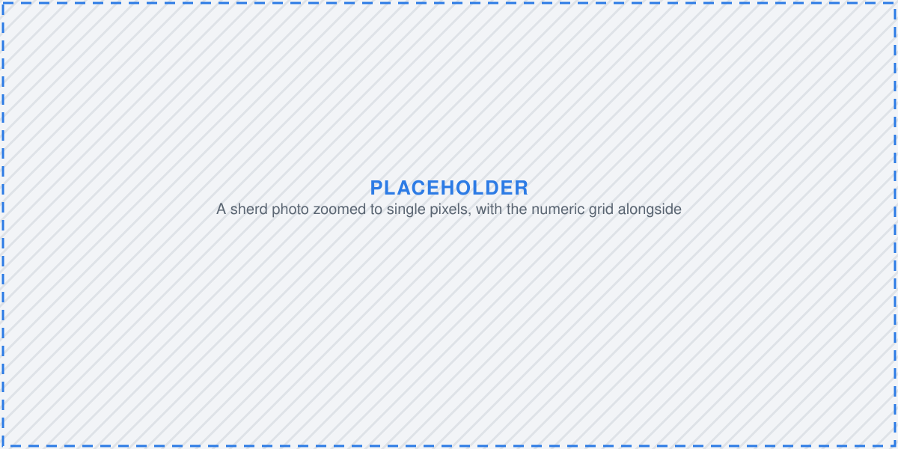
:::

::: {.smaller}
A 4000 × 3000 photograph of a sherd is 12 million numbers per colour channel — 36 million in all.
Nothing in that array says *sherd*, *rim*, or *Neolithic*.
:::

::: {.notes}
Every method this week operates on exactly this. All the sophistication lies in how the
numbers are summarised — there is no built-in understanding anywhere in the stack.
:::

## The semantic gap

::: {.placeholder}
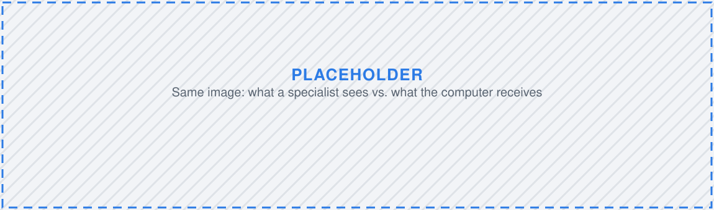
:::

:::: {.columns}
::: {.column width="48%"}
**A specialist sees**

- a rim sherd, wheel-thrown
- probably Roman
- worth three more photographs
:::
::: {.column width="48%"}
**The computer receives**

- a 4000 × 3000 × 3 array
- brightness gradients, edges, textures
- no notion of *sherd*
:::
::::

::: {.fragment}
Bridging that gap with **learned statistical regularities** is the whole enterprise.
:::

## Why now?

::: {.placeholder}
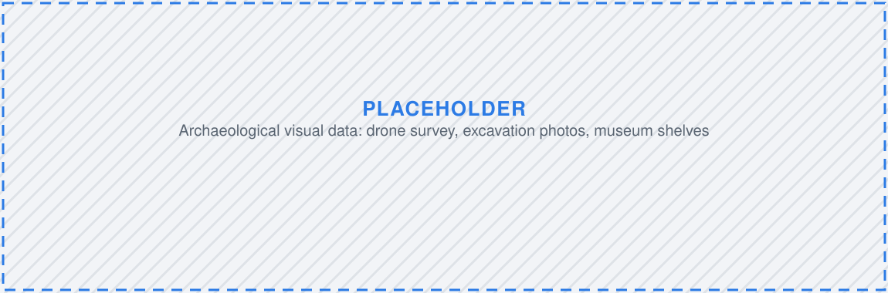
:::

::: {.incremental}
- Excavation photography is **born-digital and effectively free** — thousands of frames per season
- Drone and satellite coverage is **routine**, not exceptional
- Digitisation programmes produce **collections nobody has time to look through**
- Pre-trained models mean you no longer need a million labelled images to start
:::

::: {.fragment}
The bottleneck moved from **acquiring** images to **looking at** them.
:::

::: {.notes}
Worth saying: this is not a new ambition. Automatic feature recognition in airborne survey
was being argued about a decade and more ago — what changed is that the methods now
mostly work, and the data volume made ignoring them untenable.
:::

## It is a measurement, not an interpretation

::: {.incremental}
- A model gives you **what** and **where** — never **why**
- It reproduces whatever regularities are in its training data, including the unwelcome ones
- It is a **fast, consistent, literal-minded assistant** who has seen your training set and nothing else
:::

::: {.fragment}
> Everything a model outputs is a number you still have to interpret.
> That interpretation is your job, and it stays your job.
:::

::: {.aside}
We return to bias, black boxes and correlation on Friday.
:::

# Discussion 1 {background-color="#111111" .discussion}

## Your data, your question {.question .discussion}

**8 minutes in your group. Groups 1 & 2 report back.**

::: {.incremental}
1. Describe **one visual dataset** you work with, or would like to. How many images? Who made them? Are they public?
2. What question would you ask of it that currently takes **too long to answer by hand**?
3. If a machine handed you that answer tomorrow, **how would you check whether it was wrong**?
:::

::: {.fragment}
::: {.callout-note}
Keep your notes. Questions 2 and 3 come back in the next two rounds.
:::
:::

::: {.notes}
Circulate. Listen for questions that are really *interpretations* ("is this site Iron Age?")
— those are the productive ones to surface in the plenary, because they set up the
"good and bad questions" slide later.
:::

# The family of tasks {background-color="#111111"}

## Four questions, four output shapes

:::: {.columns}
::: {.column width="25%"}
::: {.placeholder}
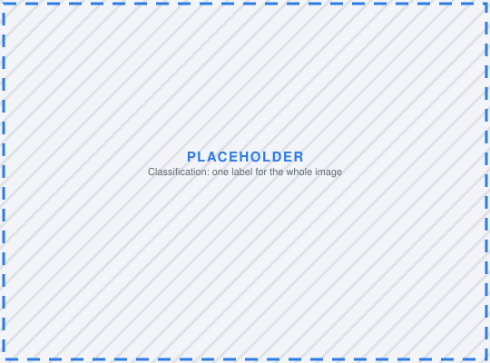
:::
**Classification**

*What is this?*

One label per image
:::
::: {.column width="25%"}
::: {.placeholder}
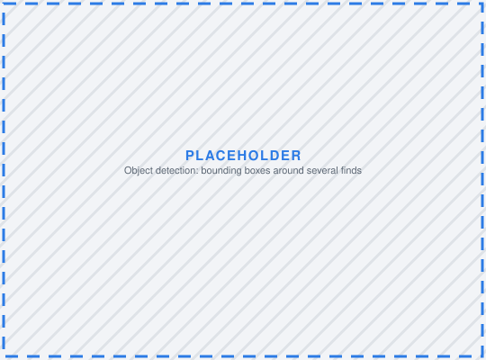
:::
**Detection**

*What, and where?*

Boxes + labels
:::
::: {.column width="25%"}
::: {.placeholder}
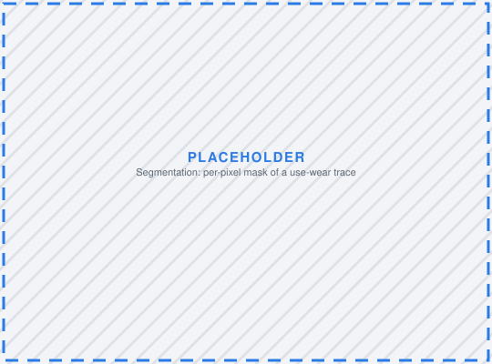
:::
**Segmentation**

*Which pixels?*

Per-pixel mask
:::
::: {.column width="25%"}
::: {.placeholder}

:::
**Keypoints**

*Where are the landmarks?*

Coordinates
:::
::::

::: {.fragment .smaller}
The choice is not technical. It follows from **the question you asked** —
and it determines **how much annotation you will have to pay for**.
:::

## The same photograph, five questions

| Task | Asked of one coin photograph | Annotation cost |
|---|---|---|
| Classification | *Is this an antoninianus?* | one label per image |
| Detection | *Where is the legend? Where is the portrait?* | a box per element |
| Segmentation | *Which pixels are corrosion?* | a traced outline per region |
| Keypoints | *Where are the die-axis markers?* | a few points per image |
| Retrieval | *Which coins in the corpus look like this one?* | none — but you need a corpus |

::: {.fragment}
Cost rises steeply down the table. **Start with the cheapest task that answers your question.**
:::

::: {.notes}
The most practical slide in the session. Many people arrive wanting segmentation when
classification would answer the question at a tenth of the annotation cost.
Friday's coins dataset is the worked example of the top four rows.
:::

## The same four shapes, across archaeology

::: {.smaller}
| Shape | Published examples |
|---|---|
| **Classification** | decorated ceramic typology from photographs [@pawlowicz2021]; amphora and faience fabrics [@santos2024]; Celtic coin classification and die studies [@deligio2024] |
| **Detection** | potsherds in high-resolution drone imagery [@orengo2019]; burial mounds in historical maps [@berganzobesg2023]; archaeological objects in LiDAR [@verschoofvan2019]; illustrated objects in scanned catalogues [@klein2025] |
| **Segmentation** | hollow roads traced in LiDAR [@verschoofvan2021]; agrarian field systems from satellite imagery [@kucukdemirci2025]; anomalies in geophysical survey images [@kucukdemirci2020] |
| **Retrieval** | 3D matching and retrieval of objects across collections [@jimenezbadil2023] |

: {tbl-colwidths="[16,84]"}
:::

::: {.refs-inline}
::: {#refs}
:::
:::

::: {.notes}
The point to make out loud: almost all of this is remote sensing and artefact
photography. Excavation-context imagery is still largely untouched — which is
where several of you are working. All of these sit in the MAIA Zotero library.
:::

## The pipeline for the rest of the week

::: {.placeholder}
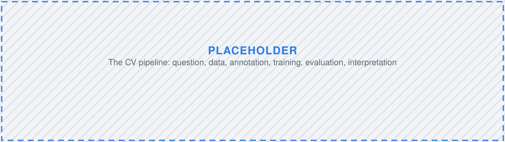
:::

::: {.smaller}
| Stage | What you decide | When |
|---|---|---|
| **Question** | what would count as an answer? | today |
| **Data & annotation** | classes, vocabulary, licences | Tuesday |
| **Pre-processing** | scale, colour, augmentation | Wednesday |
| **Training** | architecture, transfer learning | Thursday |
| **Evaluation** | which errors you can live with | Thursday–Friday |
| **Interpretation** | what you may actually claim | Friday |
:::

::: {.fragment}
Projects fail at **stage one or two**. Almost never at stage four.
:::

## Good and bad questions for a model

:::: {.columns}
::: {.column width="49%"}
::: {.box .box-disc}
**Tractable**

- *Which of these 8 000 photographs contain a scale bar?*
- *Where in this ortho-image are the circular anomalies?*
- *Which sherds share this decorative motif?*
:::
:::
::: {.column width="49%"}
::: {.box .box-gen}
**Not (yet) tractable**

- *Is this settlement Iron Age?* — from a photograph alone
- *Was this tool used on hide or on bone?* — without a reference collection
- *Which of these finds matters more?*
:::
:::
::::

::: {.fragment}
The test: **could a competent colleague answer it from the image alone, consistently, in two seconds?**
If not, a model will not either — it will simply be confident about it.
:::

# Discussion 2 {background-color="#111111" .discussion}

## Which task, and what does it cost? {.question .discussion}

**8 minutes. Groups 3 & 4 report back.**

Take the question your group settled on in round one.

::: {.incremental}
1. Which of the **four shapes** does it map onto — classification, detection, segmentation, keypoints?
2. Write the **class list**. How many classes, and be specific. What happens to images that fit **none** or **two**?
3. Would **two specialists** independently give the same image the same label? Where exactly would they disagree?
4. Estimate the **annotation bill**: how many images × how long each. Say the number out loud.
5. Is there a **cheaper task shape** that would still answer your question?
:::

::: {.notes}
Question 4 is the one that changes people's plans. Push groups to actually multiply the
numbers rather than saying "a lot". Question 3 is Tuesday's session in miniature —
flag the connection when they report back.
:::

# Two ways of learning {background-color="#111111"}

## Discriminative vs. generative

:::: {.columns}
::::: {.column width="49%"}
::: {.box .box-disc}
[Discriminative]{.disc .box-title}

Learns the **boundary between classes**.

*Given this image, what is the label?*

Answers questions **about** existing data.
:::
:::::
::::: {.column width="49%"}
::: {.box .box-gen}
[Generative]{.gen .box-title}

Learns **what the data look like**.

*What does an image of this class look like?*

**Produces new** data.
:::
:::::
::::

::: {.fragment}
> A [discriminative]{.disc} model can tell a Neolithic pot from an Iron Age one.
> A [generative]{.gen} model can draw you a Neolithic pot.
> Only one of them has ever seen the pot you care about.
:::

::: {.aside}
In notation: [discriminative]{.disc} models learn `P(label | image)`; [generative]{.gen} models learn `P(image)` or `P(image | label)`.
:::

## The same idea, drawn

:::: {.columns}
::: {.column width="49%"}
::: {.placeholder}
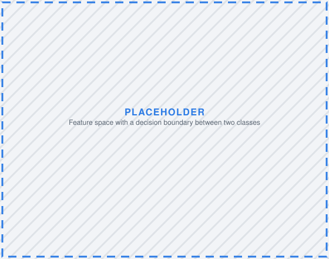
:::
::: {.box .box-disc}
[Discriminative]{.disc} — draw a line separating the classes.
Anything far from the line is ignored.
:::
:::
::: {.column width="49%"}
::: {.placeholder}
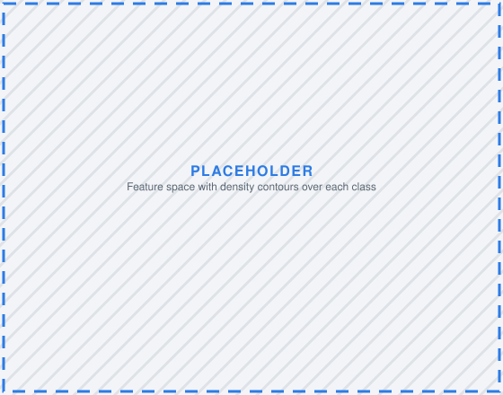
:::
::: {.box .box-gen}
[Generative]{.gen} — model where each class *lives*.
You can then sample new points from it.
:::
:::
::::

## [Discriminative]{.disc} — the working horse of the week

::: {.placeholder .placeholder-sm}

:::

::: {.incremental}
- **Artefact classification** — a typological class for a photographed find
- **Feature detection** on LiDAR and satellite imagery — mounds, enclosures, field systems, hillforts
- **Use-wear segmentation** — the pixels showing a particular polish or striation
- **Triage** — separating scale-bar-only frames from find photographs
- **Retrieval** — *"show me the twenty most similar sherds in the corpus"*
:::

::: {.fragment}
Common thread: the model **points at evidence that already exists**.
:::

## [Generative]{.gen} — a smaller part of the picture

:::: {.columns}
::: {.column width="32%"}
::: {.placeholder}
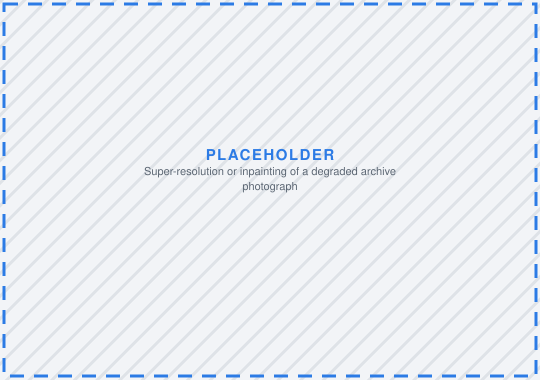
:::
**Restoration**

Sharpening or completing degraded archive imagery
:::
::: {.column width="32%"}
::: {.placeholder}
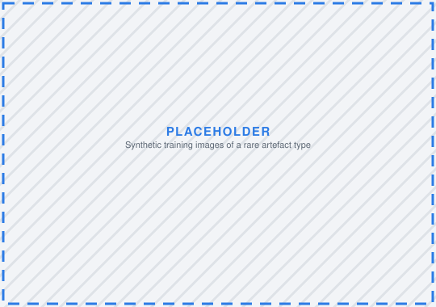
:::
**Synthetic training data**

Manufacturing examples for rare classes
:::
::: {.column width="32%"}
::: {.placeholder}
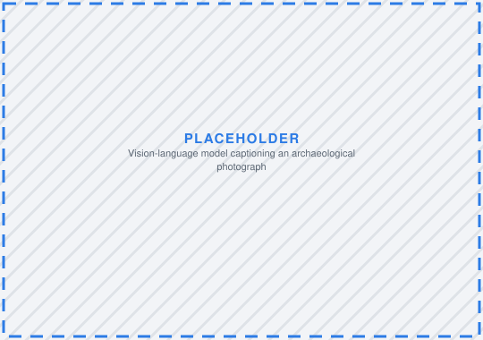
:::
**Vision-language models**

Describing an image, answering questions about it
:::
::::

::: {.fragment}
Common thread: the model **produces something that was not in the record**.
:::

::: {.aside}
We touch generative methods only where they are useful to us — synthetic data on Wednesday,
vision-language models on Friday. This school is not about generative AI.
:::

::: {.notes}
Synthetic training data is where the two families meet productively: a generative model
manufactures examples that train a discriminative one. Published work has done exactly this
for Roman fine ware. Mention it, then move on — the room does not need a diffusion lecture.
:::

## Side by side

| | [Discriminative]{.disc} | [Generative]{.gen} |
|---|---|---|
| **Learns** | the boundary between classes | the distribution of the data |
| **In → out** | image → label / box / mask | prompt or noise → image / text |
| **Typical models** | CNNs, YOLO, ResNet, SAM | diffusion, GANs, VAEs, VLMs |
| **Needs** | labelled examples | many examples; labels optional |
| **Fails by** | confident wrong labels | plausible fabrication |
| **Evidential status** | a measurement to verify | an illustration or a hypothesis |

::: {.fragment}
::: {.callout-warning}
## The asymmetry that matters
A [discriminative]{.disc} error is **visible** — the box is in the wrong place.
A [generative]{.gen} error is **invisible** — a fabricated rim looks exactly as convincing as a real one.
:::
:::

## Where the line blurs

::: {.incremental}
- **Vision-language models** generate text — but you use them to *classify*: *"is there pottery in this photo?"*
- **Segment Anything (SAM)** is a foundation model *prompted* like a generative one, producing discriminative masks
- **Synthetic augmentation** uses a generative model to feed a discriminative one
:::

::: {.fragment}
The distinction is not a rigid taxonomy of architectures. It is about
**what the model outputs, and what you are entitled to claim from it**.
:::

::: {.fragment}
That is exactly what the next eight minutes are for.
:::

# Live demo {background-color="#111111"}

## Zero-shot classification with CLIP

You give the model an image and a **list of candidate descriptions in plain English**.
It tells you which description fits best. **No training. No annotation.**

```python
labels = ["a photo of a potsherd",
          "a photo of a coin",
          "a photo of a stone tool",
          "a photo of a scale bar"]

image = load("find_0042.jpg")
probs = clip_zero_shot(image, labels)   # → [0.81, 0.05, 0.11, 0.03]
```

::: {.fragment}
**Watch first — you will run this yourself later in the week.**
:::

::: {.aside}
Notebook: `materials/clip_zero_shot.ipynb`, on the [CERIT-SC JupyterHub](https://docs.cerit.io/en/docs/web-apps/jupyterhub){.external}.
:::

::: {.notes}
Run this live on two or three images from the artefact dataset. Then deliberately break it:
feed it a sherd photograph with only the labels "a coin" / "a stone tool" and show that it
answers confidently anyway. That failure is the seed of Discussion 3.
:::

## What just happened?

::: {.placeholder .placeholder-sm}
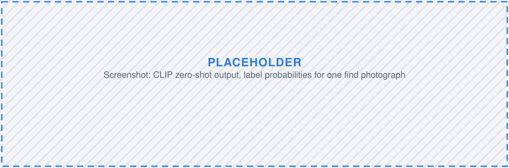
:::

::: {.incremental}
- The model never saw an archaeological training set — it learned from **image–caption pairs off the internet**
- It is being used **[discriminatively]{.disc}** (a label out) but was trained the way a [generative]{.gen} model is
- Change the wording of a label and the answer changes — **the vocabulary is now a parameter**
- Give it only wrong options and it will still pick one, **confidently**
:::

::: {.fragment}
::: {.callout-important}
Zero-shot is a superb way to **explore** a collection. It is a poor way to **report a number**.
:::
:::

# Discussion 3 {background-color="#111111" .discussion}

## What may you claim? {.question .discussion}

**6 minutes. Groups 5 & 6 report back.**

A colleague reports: *"Our model detected 340 previously unrecorded burial mounds in the survey area."*

::: {.incremental}
1. What do you need to know before you believe that number?
2. What is the difference between **340 detections** and **340 mounds**?
3. What if the model was trained on mounds from a **different region** entirely?
4. The paper includes a **generated reconstruction** of one mound. What must the caption say?
5. Now apply all of this to the **CLIP result** you just watched. Would you put it in a paper? With what caveat?
:::

::: {.notes}
The answer to (2) is precision and recall — do not give it away, let a group arrive at it,
then name it. That is the hook into Thursday's evaluation session.
:::

## Reporting back

Groups 5 & 6, then everyone in one sentence:

::: {.incremental}
- The **dataset** and the **question** you settled on
- The **task shape** and the **annotation bill**
- The **one thing** that would make it fail
:::

::: {.fragment}
::: {.callout-note}
These become our working problems for the week. If your question is tractable with one of
our five datasets, we will try to get you to an answer by Friday — and you can present it
on **Tuesday afternoon**.
:::
:::

# Wrapping up {background-color="#111111"}

## Five datasets, five questions

::: {.placeholder}
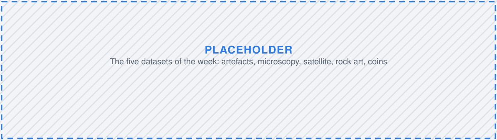
:::

::: {.smaller}
| Dataset | Day | Task shape |
|---|---|---|
| Artefacts | Tuesday | classification & detection |
| Microscopy — use-wear | Wednesday | segmentation |
| Satellite imagery | Thursday | detection |
| Rock art | Thursday | *to be confirmed* |
| Coins | Friday | combined methods, vision-language models |
:::

## Five things to carry into the week

::: {.incremental}
1. An image is **numbers**; a model is a **very literal assistant**
2. The **task shape follows from the question** — and it sets the **annotation bill**
3. [Discriminative]{.disc} models **point at evidence**; [generative]{.gen} models **manufacture plausibility**
4. Both are useful; only one of them is a **measurement**
5. Projects fail at **question and data**, not at training
:::

::: {.fragment}
### Next up

Setting up the environment — Google Colab and the tools we use for the rest of the week.
:::

## Where to read more {.smaller}

The **MAIA** COST Action maintains a shared, open Zotero library on AI in archaeology —
[zotero.org/groups/5991067](https://www.zotero.org/groups/5991067/maia_managing_ai_in_archaeology/library){.external}

:::: {.columns}
::: {.column width="49%"}
**Start here**

- Bellat et al. 2025 — *Machine learning applications in archaeological practices: a review*
- Gattiglia 2025 — *Managing Artificial Intelligence in Archaeology: an overview*
- Bickler 2021 — *Machine Learning Arrives in Archaeology*
- Tenzer et al. 2024 — *Debating AI in Archaeology*
- Calder et al. 2022 — *Use and Misuse of Machine Learning in Anthropology*
:::
::: {.column width="49%"}
**Worked case studies**

- Pawlowicz & Downum 2021 — ceramic typology from photographs
- Orengo & Garcia-Molsosa 2019 — potsherd detection on drone imagery
- Verschoof-van der Vaart & Lambers 2019 — R-CNN on LiDAR
- Fiorucci et al. 2022 — evaluation measures for detection on LiDAR
- Deligio et al. 2024 — ClaReNet, classifying Celtic coinage
- Núñez Jareño et al. 2021 — synthetic data for Roman fine ware
:::
::::

::: {.aside}
Slides, notebooks and datasets: [github.com/arup-cas/atrium-school-ml](https://github.com/arup-cas/atrium-school-ml) ·
Licences: MIT (code) & CC BY-SA 4.0 International (other content).
:::
