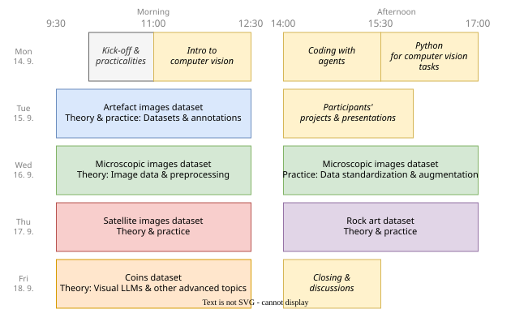

The programme is organised by topics and dataset types.
Each topic builds on the previous one, guiding participants from foundational skills to advanced applications of computer vision in archaeology.

## Programme

{width="100%"}

### Monday 

*Kick-off & Python for CV*

**Morning**

- Kick-off, practicalities, and motivations
- Introduction to the workshop structure 
- Introduction co computer vision and questions computer vision can answer
- Setting up the technical environment (Google Colab and tools)

**Afternoon**

- Coding with agents
- Python fundamentals for computer vision tasks

**Evening** 

- Ice-breaker event

### Tuesday 

**Morning**

*Artefacts Dataset*

- Image datasets and annotation -- *theory & practice*
- Datasets, licensing, controlled vocabularies, and annotation challenges

**Afternoon**

- **Presentations of participants' projects and datasets?**  

    > Do you want to showcase anything? Present what you work on? Use this opportunity to showcase what you do and discuss the problems you encounter! We will discuss and try to find solutions together...

### Wednesday

*Microscopy Dataset*

**Morning**

- Data standardization (brightness, contrast, size, RGB/grayscale) and image pre-processing
- Data pre-processing and augmentation
- OpenCV: detection masks and data augmentation

**Afternoon**

- Practical part: data standardization and augmentation

### Thursday 

**Morning**

*Satellite Imagery*

- Satellite imagery and remote sensing in theory and analysis
- Object detection on satellite images

**Afternoon**

*Rock Art dataset*

- 

### Friday

**Morning**

*Coins Dataset*

- Advanced topics illustrated on coins dataset and combining methods
- LLMs and vision-language models
- Bias, reproducibility, black-box models, attention maps, and causation–correlation problems

**Afternoon**

- Closing and discussion

<!-- ## Topics in Detail

### Python for Computer Vision Tasks

- Setting up a Python environment and Jupyter notebooks
- Key libraries: `NumPy`, `Matplotlib`, `OpenCV`
- Working with images in Python: reading, displaying, and basic manipulation

### Datasets and Annotation

- Overview of computer vision tasks: classification, object detection, segmentation
- Annotation tools and common formats (`COCO`, `YOLO` etc.)
- Best practices for creating, managing, and documenting datasets

### Data Pre-processing

- Image transformations, colour normalisation, and data augmentation
- Splitting data and handling class imbalance
- Building data pipelines with PyTorch `Dataset` and `DataLoader`

### Training

- Core concepts: CNNs, transfer learning, pre-trained models (ResNet, YOLO)
- Setting up training: loss functions, optimisers, and monitoring metrics
- Practical session: training a model on an archaeological dataset

### Post-processing

- Interpreting outputs: confidence scores, bounding boxes, masks
- Evaluation metrics: precision, recall, mAP, IoU
- Error analysis and visualising results

### Advanced Topics

- Vision-language models: zero-shot classification, prompt-based detection (CLIP)
- Instance and semantic segmentation in detail
- Deploying models -->

## Case Studies

Throughout the school, participants will work with four real-world archaeological datasets:

- **Artefact types:** classification and detection of archaeological artefacts from photographs
- **Microscopic use-wear analysis:** identifying and classifying wear traces from microscopic images
- **Satellite imagery:** remote sensing and object detection on satellite data
- **Rock art:** 
- **Coins:** combining techniques on photographs and drawings of coins and exploring model interpretability

## Social Events

- **Ice-breaker** on the first evening (Monday)
- **Walking meeting** on Tuesday evening, a short city *tour* of Brno
- **Social event** on Wednesday evening