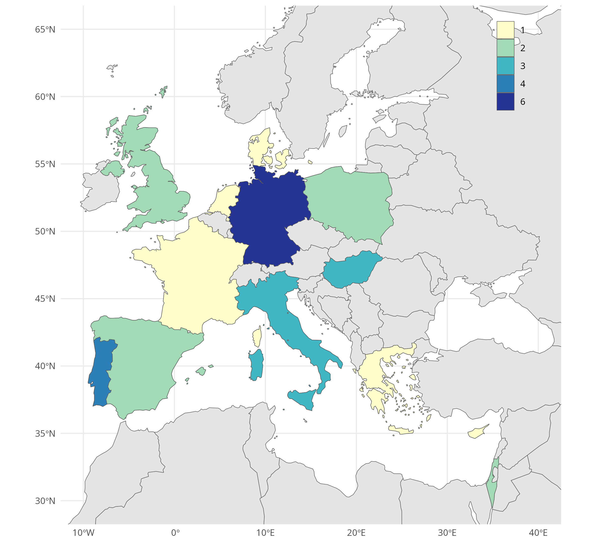
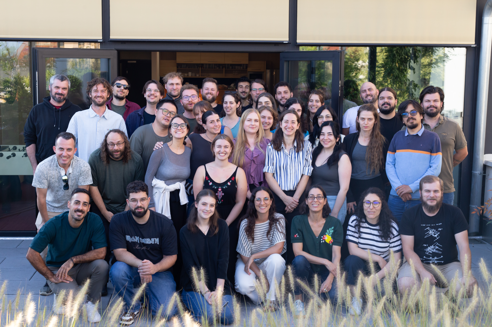

::: {.callout-important}

## Post-school survey

If you participated, please **fill in a post-school survey** [here](https://forms.gle/zCKCoVHfb8aKJTaX7){.external}.

:::

We had 29 participants with affiliations across Europe and beyond working in fields like archaeology, forensic science, art history and restoration and more!

{fig-align="center" width="80%"}

## Photos

{.shadow}

There is a **gallery** [here](https://immich.spacilovi.eu/share/8AKqR9S5J4s9GJCFBMKDxzgJgXyNzAt85knmOeFg2kIKJoj9T30qiPpPXAsCXvIKGeo){.external} (will stay here for a couple of weeks, than we'll archive it)


## Reports by the participants

::: {.callout-important}
## You have to write a report!

You are obliged to hand in a written report.
Only after you submit the report, we can pay you the grant money you are supposed to recieve.

The report can be anything in writing, we especially invite you to write a **blog post** for [ATRIUM TNA Blog](https://atrium-research.eu/blog/){.external}.

Examples can be found on pages of previous training schools on [R and Spatial data (atRium)](https://petrpajdla.github.io/atRium/report.html){.external} and [3D models and photogrammetry](https://arup-cas.github.io/atrium-school3d/report.html){.external}.
For example the one by [Nicky Garland](https://atrium-research.eu/blog/computational-archaeology-summer-school-in-brno-czech-republic/){.external} or by [John Kanyingi](https://atrium-research.eu/blog/exploring-3-d-reconstruction-at-the-brno-institute-of-social-sciences-a-transformative-training-journey/){.external}.


:::

<!--

```{r}
#| echo: false
read.csv(here::here("reports/list.csv")) |>
  knitr::kable()
``` -->
