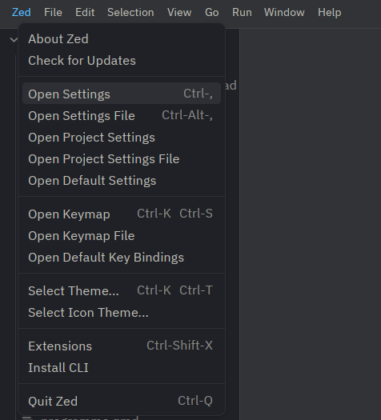
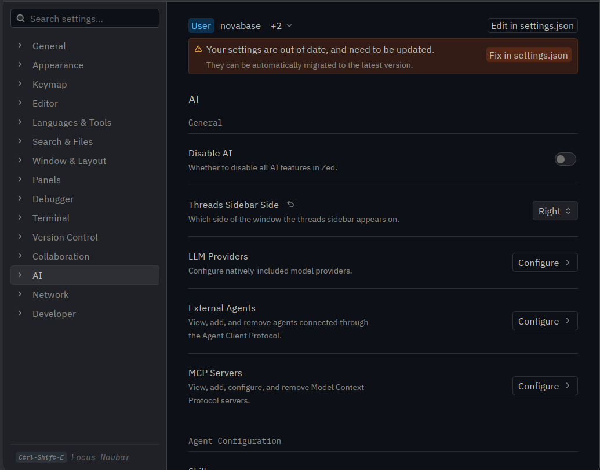
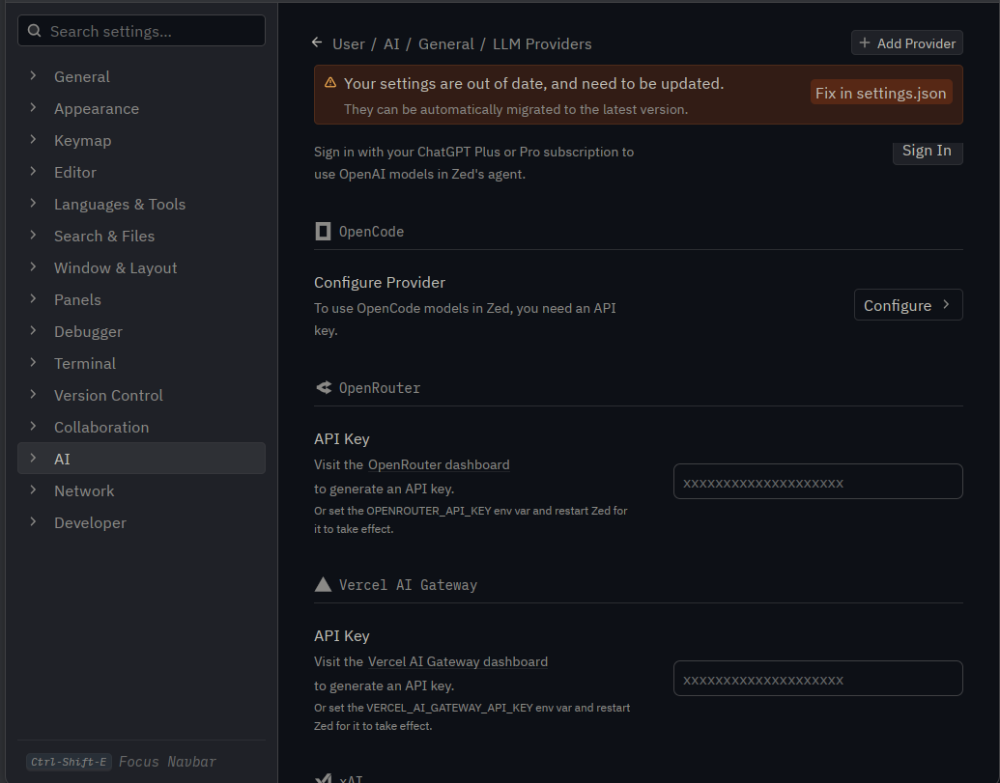

::: {.callout-important}

## Alert!

The instructions might change, please check this page shortly before the school begins. 

:::


## Python

Install Python (3.10+), follow guidance on the official [website](https://www.python.org/){.external} or use your system's package manager.

<!-- ### JupyterLab

Install JupyterLab with `pip`:

```python
pip install jupyterlab
``` -->


## Git

Install Git, on Windows foolow this [guide](https://gitforwindows.org/){.external}, on MacOS this [one](https://git-scm.com/install/mac){.external} and on Linux you probably already have it and presumably know what you are doing.


## IDE

Install and use an IDE of your choice, preferably [Zed](https://zed.dev/){.external} or [VSCode](https://code.visualstudio.com/){.external}.

### Zed

::: {.justify}
[Zed](https://zed.dev/){.external} is a fast, open-source editor with a built-in AI agent, so you don't need to install any extension to get coding assistance. We will use it during the school together with the API key you will be given, see [Agent Integration](#agent-integration) below.
:::

::: {.panel-tabset}
## Windows

Download the installer from the [download page](https://zed.dev/download){.external}, or run in PowerShell:

```powershell
winget install -e --id ZedIndustries.Zed
```

## macOS

Download from the [download page](https://zed.dev/download){.external}, or run in Terminal:

```bash
curl -f https://zed.dev/install.sh | sh
```

## Linux

Run in a terminal:

```bash
curl -f https://zed.dev/install.sh | sh
```

Your distribution may also package Zed, in which case feel free to use your package manager.
:::

Zed keeps itself up to date, so you only need to do this once.


## Agent Integration

::: {.justify}
During the school you will be granted access to LLM Agent via [OpenRouter](https://openrouter.ai/){.external} to support you in coding. OpenRouter is a gateway that gives you access to many models (Claude, GPT, Gemini, open-weight models, ...) through a single API key -- the one you will receive at the start of the school.
:::

::: {.callout-note}
If you already use a different coding assistant or have a Claude subscription, you can use your own settings, we do not require you to use this.
:::

### Add your API key to Zed

:::: {.panel-tabset}

## Zed settings UI

*This is the recommended way -- the key is stored in your system keychain and survives restarts.*

1. Open the settings from the menu: `Zed` > `Open Settings` (`ctrl-,`, on macOS `cmd-,`).

    {width="60%" fig-alt="Zed menu with the Open Settings item"}

2. Pick `AI` in the left sidebar, and under `General` click `Configure` next to `LLM Providers`.

    {width="100%" fig-alt="AI section of Zed settings with the LLM Providers row"}

3. Scroll down to the **OpenRouter** section and paste the key you were given into the `API Key` field, then confirm with `enter`.

    {width="100%" fig-alt="OpenRouter provider with the API Key field"}

Once the key is accepted, OpenRouter models show up in the model selector in the agent panel.

## Environment variable

Instead of pasting the key into the settings, you can set the `OPENROUTER_API_KEY` environment variable -- Zed reads it from the environment it was started in, so you have to **restart Zed** for it to take effect.

::: {.panel-tabset}
## Windows

```powershell
setx OPENROUTER_API_KEY "sk-or-v1-REPLACE-ME"
```

`setx` stores the variable permanently, but it only applies to programs started after you run it.

## macOS

```bash
export OPENROUTER_API_KEY="sk-or-v1-REPLACE-ME"
```

This is not permanent -- it only applies to the current terminal session, so start Zed from that same terminal (`zed .`), or add the line to your `~/.zshrc`.

## Linux

```bash
export OPENROUTER_API_KEY="sk-or-v1-REPLACE-ME"
```

This is not permanent -- it only applies to the current terminal session, so start Zed from that same terminal (`zed .`), or add the line to your `~/.bashrc`.
:::

::::

### Using the agent in Zed

- **Agent panel** -- click the ✨ icon in the status bar, or run `agent: new thread` from the command palette. This is the chat-style assistant that can read and edit files in your project.
- **Pick a model** -- use the model selector above the message box, or `cmd-alt-/` (macOS) / `ctrl-alt-/` (Windows/Linux). With the school key, only **GLM 5.3 Flash** and **DeepSeek V4.1 Flash** are available.
- **Inline assist** -- press `ctrl-enter` in the editor or terminal to ask for a change right where your cursor is; select a block of code first to have it rewritten.

::: {.callout-tip}
If you want to set a default model, so you don't have to pick it in every new thread, you can edit Zed's `settings.json` directly -- `Zed` > `Open Settings File` (`ctrl-alt-,`, on macOS `cmd-alt-,`):

```json
{
  "agent": {
    "default_model": {
      "provider": "openrouter",
      "model": "deepseek/deepseek-v4.1-flash"
    }
  }
}
```

The other available model is **GLM 5.3 Flash** -- you can copy its exact identifier from the model selector or from the [OpenRouter models page](https://openrouter.ai/models){.external}.
:::

::: {.callout-important}
# Attention

- **Never** share your key or commit it to a repository.
- The key is time-limited, has a spending limit, and will stop working after the school.
- Only two models are available to you: **GLM 5.3 Flash** and **DeepSeek V4.1 Flash**.
- **Never** put personal data or non-public information into the agent -- whatever you send goes to a third-party service.
:::


## Docker or Podman

Install Docker or Podman:

::: {.panel-tabset}
## Docker

Follow official documentation [here](https://docs.docker.com/get-started/get-docker/){.external}. On Windows, Docker is probably easier to install.

## Podman

Documentation [here](https://podman.io/){.external}.
:::


## Accounts

You might need a Google account (to access Google Colab) and a [HuggingFace](https://huggingface.co/){.external} account.